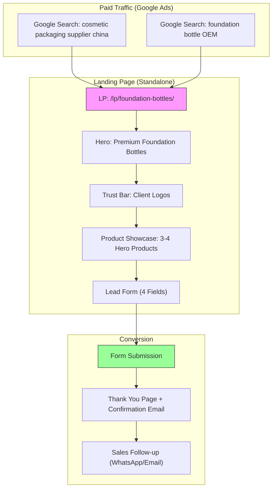
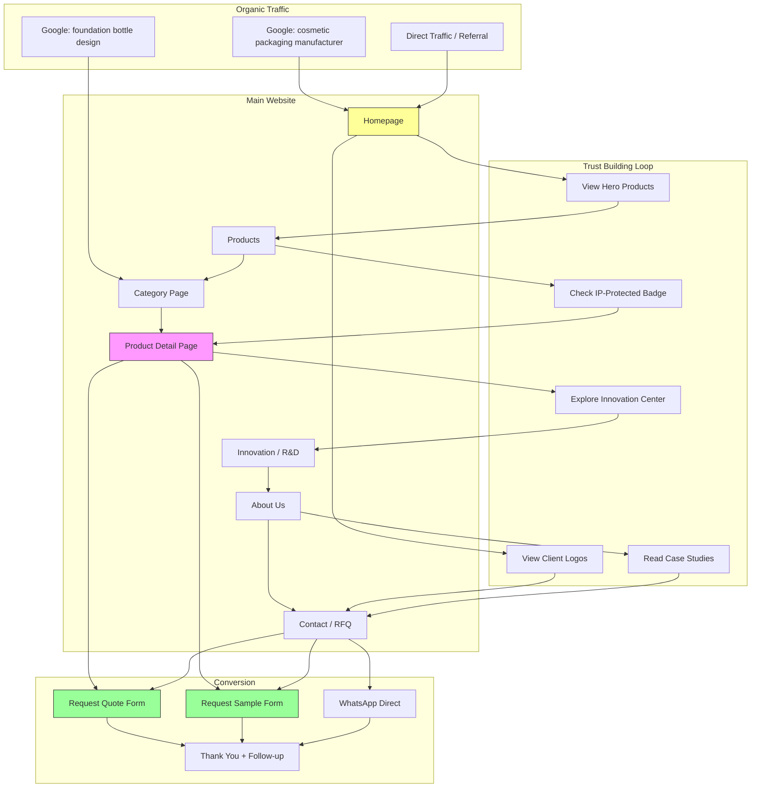

# YUSU 独立站信息架构方案

> **版本**: v1.1  
> **日期**: 2026-01-22  
> **客户**: 广州宇塑包装制品有限公司 (YUSU)  
> **定位**: R&D-Powered Cosmetic Packaging Innovator

---

## 1. 站点地图 (Sitemap)

### 1.1 层级结构总览

```
L1                  L2                           L3
─────────────────────────────────────────────────────────────────
Home ───────────────────────────────────────────────────────────── [品牌信任 + 转化入口]
│
├── Products ────── Foundation Bottles ─────── Gold Bar (B-AP40) ★ [英雄产品]
│   │               │                          Plum Blossom (A-BE23) ★ [英雄产品]
│   │               │                          Chamfered (B-AP37) ★ [英雄产品]
│   │               │                          [其他粉底液瓶...]
│   │               │
│   │               ├── Lip Packaging ──────── Lipstick Tubes
│   │               │                          Lip Glaze Tubes
│   │               │
│   │               ├── Sun Protection ─────── Sunscreen Bottles
│   │               │
│   │               ├── Perfume Bottles ────── [香水瓶系列]
│   │               │
│   │               ├── Skincare ───────────── [护肤包材系列]
│   │               │
│   │               └── Air Cushion & Compact ─ Air Cushion Cases
│   │                                          Powder Compact Cases
│   │
│   └── [Product Detail Page Template]
│
├── Innovation ──── R&D Center ──────────────────────────────────── [R&D 实力展示]
│   │               Design Library
│   │               IP-Protected Originals
│   │               Technology & Craftsmanship
│   │
├── Services ───────────────────────────────────────────────────── [私模定制服务]
│   │               (单页，无子页面)
│   │
├── About ──────── Company Story ────────────────────────────────── [品牌信任]
│   │               Factory & Facilities
│   │               Quality Assurance
│   │               Certifications
│   │
├── Resources ──── Blog / Industry Insights ─────────────────────── [SEO 内容]
│                   FAQ
│
├── Contact ───────────────────────────────────────────────────────── [转化承接]
│
└── [Landing Pages] ─ LP-Foundation (Google Ads) ─────────────────── [付费流量专用]
                      LP-OEM (Google Ads)
                      LP-Custom-Packaging (Google Ads)
```

### 1.2 页面职能标注表

| 层级 | 页面名称 | 英文路径建议 | 主要职能 | 备注 |
|------|----------|--------------|----------|------|
| L1 | 首页 | `/` | 品牌信任 + 产品引流 + 转化入口 | 核心流量入口 |
| L1 | 产品中心 | `/products/` | 全品类展示，暗示供应链规模 | 类别索引页 |
| L2 | 粉底液瓶 | `/products/foundation-bottles/` | 产品展示，英雄产品突出 | 重点类别 |
| L2 | 唇部包材 | `/products/lip-packaging/` | 产品展示 | - |
| L2 | 防晒瓶 | `/products/sun-protection/` | 产品展示 | - |
| L2 | 香水瓶 | `/products/perfume-bottles/` | 产品展示 | - |
| L2 | 护肤包材 | `/products/skincare/` | 产品展示 | - |
| L2 | 气垫粉饼盒 | `/products/cushion-compact/` | 产品展示 | - |
| L3 | **小金条 B-AP40** ★ | `/products/foundation-bottles/gold-bar-bottle/` | 产品转化，IP-Protected | 英雄产品 #1 |
| L3 | **梅花瓶 A-BE23** ★ | `/products/foundation-bottles/plum-blossom-bottle/` | 产品转化，文化故事 | 英雄产品 #2 |
| L3 | **切角瓶 B-AP37** ★ | `/products/foundation-bottles/chamfered-bottle/` | 产品转化，几何美学 | 英雄产品 #3 |
| L1 | 创新中心 | `/innovation/` | R&D 实力外显，信任建设 | 核心差异化 |
| L2 | R&D中心 | `/innovation/rd-center/` | 专利+研发能力展示 | - |
| L2 | 设计库 | `/innovation/design-library/` | 1000+ 设计展示 | - |
| L2 | IP保护原创 | `/innovation/ip-protected-originals/` | 130+ 专利展示 | - |
| L1 | 私模定制 | `/services/` | 私模定制服务 (整合页) | 核心转化页 |
| L1 | 关于我们 | `/about/` | 品牌信任，工厂实力 | - |
| L1 | 资源中心 | `/resources/` | SEO内容载体 | - |
| L2 | 博客 | `/resources/blog/` | 行业洞察，SEO | - |
| L2 | FAQ | `/resources/faq/` | 常见问题，SEO | - |
| L1 | 联系我们 | `/contact/` | 转化承接，询盘表单+联系方式 | 单一综合询盘页 |
| - | **LP-粉底液瓶** | `/lp/foundation-bottles/` | 付费流量转化 | Google Ads 专用 |
| - | **LP-OEM定制** | `/lp/oem-custom/` | 付费流量转化 | Google Ads 专用 |
| - | **LP-包材供应商** | `/lp/packaging-supplier/` | 付费流量转化 | Google Ads 专用 |

---

## 2. 核心页面模块定义

### 2.1 首页 (Homepage)

**适用营销框架**: **AIDA + StoryBrand 混合模型**

> **选择理由**: 首页需在 3 秒内抓住注意力 (Attention)，快速建立"R&D 驱动"的品牌差异化认知 (Interest)，展示英雄产品激发需求 (Desire)，并引导询盘 (Action)。StoryBrand 的"英雄之旅"叙事帮助客户将自己代入为"成功品牌缔造者"，YUSU 作为"向导"角色提供解决方案。

| 模块名称 | 模块目的 | 建议内容要素 | AIDA 阶段 |
|----------|----------|--------------|-----------|
| **Hero Section** | 第一印象，品牌定位传达 | 主标题: "R&D-Powered Cosmetic Packaging"<br>副标题: "100s of New Designs Every Year. 130+ Selected for IP Protection."<br>信任指标: In-House R&D Since 2017 \| 1000+ Design Library \| Top 100 China Beauty Packaging<br>CTA: "Explore Products" / "Get a Quote"<br>背景: 英雄产品 B-AP40 高清场景图 | Attention |
| **Trust Bar** | 快速建立规模感信任 | 客户 Logo 横幅 (Perfect Diary, ZEESEA, COSMAX 等)<br>滚动或静态展示 6-8 个知名客户 | Interest |
| **Hero Products Spotlight** | 英雄产品突出展示 | 3 张英雄产品卡片 (B-AP40, A-BE23, B-AP37)<br>每张包含: 产品图 + "🔒 IP-Protected" 徽章 + 一句卖点 + "View Details"<br>整体标题: "Signature Designs" 或 "Featured Originals" | Desire |
| **Full Category Overview** | 暗示供应链规模 | 产品类别网格 (6 大类)<br>每类: 代表产品图 + 类别名 + 产品数量 (如 "50+ Designs")<br>CTA: "View All Products" | Interest |
| **Innovation Snapshot** | R&D 差异化外显 | 数据可视化: 130+ IP-Protected \| 1000+ Designs \| 100s New/Year<br>简短文案: "Where Beauty Meets Engineering"<br>CTA: "Discover Our Innovation" → 链接至 Innovation 页 | Interest |
| **One-Stop Service** | 服务能力快速介绍 | 5 步图标流程: Design → Mold → Production → Printing → QC<br>强调: "Faster Delivery | 50%+ Faster Mold Development" | Desire |
| **Social Proof / Testimonials** | 信任背书强化 | 1-2 条客户引言 (含客户名/公司/Logo，如允许)<br>或: 合作工厂 Logo 墙 (COSMAX, NBC 等) | Interest |
| **Final CTA Section** | 转化收尾 | 标题: "Ready to Elevate Your Brand?"<br>双 CTA: "Request Samples" / "Get a Quote"<br>背景: 工厂/产品线场景图 | Action |
| **Footer** | 站点导航 + 联系信息 | 快速链接、联系方式、社交媒体、版权信息 | - |

---

### 2.2 产品类别页 (Category Page)

**适用营销框架**: **FAB (Features-Advantages-Benefits)** + 视觉筛选

> **选择理由**: B2B 买家在类别页需要快速筛选和对比，FAB 帮助将产品特性转化为客户利益。视觉筛选满足"东南亚买家看规模"的需求。

| 模块名称 | 模块目的 | 建议内容要素 |
|----------|----------|--------------|
| **Category Hero** | 类别定位 + 快速进入 | 类别名称 (如 "Foundation Bottles")<br>类别简介 (1-2 句)<br>英雄产品标注: "★ IP-Protected Signature Design"<br>产品数量: "Explore 50+ Designs" |
| **Filter & Sort** | 筛选便利性 | 筛选项: Capacity (15ML/30ML/50ML) \| Material (Glass/Plastic) \| Style (Luxury/Minimal/Classic) \| Protection Status (IP-Protected/All)<br>排序: Popularity \| Newest \| Price Range |
| **Product Grid** | 产品视觉展示 | 产品卡片网格 (3-4 列)<br>每卡片: 产品图 + 名称 + 编码 + 容量 + "🔒 IP-Protected" 徽章 (如适用)<br>Hover 效果: 显示 "Quick View" / "Request Quote"<br>**英雄产品置顶**，带"Featured"徽章 |
| **Category USP Bar** | 类别层面信任 | "Why YUSU Foundation Bottles"<br>3-4 个图标卖点: IP Protection \| 24H Glass Line \| 50%+ Faster Mold \| Free Samples |
| **Related Services CTA** | 交叉引流 | "Need a Custom Design?"<br>CTA → OEM/ODM 页面 |

---

### 2.3 产品详情页 (Product Detail Page)

**适用营销框架**: **PAS (Problem-Agitate-Solution)** + **FAB**

> **选择理由**: B2B 买家在详情页需要解决"这个产品能否解决我的问题"。PAS 帮助识别痛点并放大，FAB 将产品规格转化为业务价值。

| 模块名称 | 模块目的 | 建议内容要素 |
|----------|----------|--------------|
| **Product Visual Gallery** | 产品 360° 展示 | 主图 + 多角度图 (至少 4 张)<br>可选: 使用场景图、与真实化妆品组合图<br>视频: 产品细节展示 (如有) |
| **Product Quick Info** | 关键信息速览 | 产品名称、编码 (如 B-AP40)<br>🔒 IP-Protected Design 徽章<br>容量: 30ML<br>主要材质: Glass + Aluminum<br>起订量: MOQ 10,000 pcs |
| **Primary CTA** | 首屏转化入口 | 双按钮: "Request a Quote" / "Order Samples"<br>信任指标: Free Samples Available \| Fast Lead Time |
| **Product Story (PAS)** | 痛点共鸣 + 产品价值 | **Problem**: 标准包材难以脱颖而出<br>**Agitate**: 竞争激烈，品牌需要独特视觉识别<br>**Solution**: "Exclusive Original design, protected and available only through YUSU..."<br>融入产品设计灵感 (如 B-AP40 灵感来源、A-BE23 梅花文化寓意) |
| **Specifications Table** | 技术参数 | 完整规格表: 容量、尺寸、材质、工艺描述、可定制项<br>可下载: Spec Sheet PDF |
| **Customization Options** | 定制能力展示 | 可选定制: 颜色、电镀、UV涂层、Logo印刷<br>CTA: "Discuss Customization" |
| **Craft & Quality** | 工艺价值传达 | 工艺描述 (电镀、喷涂等)<br>质量控制: QC 流程图标<br>材质: 玻璃线源头品控说明 |
| **Related Products** | 交叉销售 | 同类别其他产品 (3-4 个)<br>"You May Also Like" |
| **FAQ Accordion** | 常见问题解答 | 3-5 条产品相关 FAQ<br>如: "What is the MOQ?", "Can I customize the color?", "What is the lead time?" |
| **Sticky CTA Bar** | 持续可见转化 | 滚动时底部固定<br>产品名 + "Request Quote" 按钮 |

---

### 2.4 关于我们 / R&D 创新中心 (About / Innovation)

**适用营销框架**: **StoryBrand (Brand as Guide)**

> **选择理由**: 东南亚 B2B 买家重信任，StoryBrand 将 YUSU 定位为"可信赖的向导"，帮助客户 (英雄) 实现品牌成功。

#### 2.4.1 About Us 页面

| 模块名称 | 模块目的 | 建议内容要素 |
|----------|----------|--------------|
| **Company Story Hero** | 品牌起源 + 使命 | 标题: "Shaping Brands Since 2014"<br>简述: 从广州起步，10 年化妆品包材专注<br>愿景 + 使命陈述 |
| **Milestone Timeline** | 规模感 + 成长轨迹 | 关键里程碑: 2014 成立 → 2017 R&D 中心 → 2025 百强 → 130+ 专利 |
| **Factory & Facilities** | 信任背书 | 工厂实拍图/视频<br>24H 玻璃生产线、模具房、QC 中心<br>数据: X 万平米、X 条产线 |
| **Certifications** | 合规背书 | 认证徽章: ISO (如确认)、Top 100 Packaging 2025<br>环保/合规说明 |
| **Team / Leadership** | 人文信任 | 可选: 核心团队介绍 (如创始人、研发负责人) |
| **CTA** | 转化引导 | "Partner With Us" → Contact 页 |

#### 2.4.2 Innovation / R&D 页面

| 模块名称 | 模块目的 | 建议内容要素 |
|----------|----------|--------------|
| **Innovation Hero** | R&D 差异化首屏 | 标题: "Where Beauty Meets Engineering"<br>副标题: "In-House R&D Since 2017"<br>背景: 研发中心/设计过程照片 |
| **Data Visualization** | 核心数据外显 | 大数字展示 (动画计数):<br>130+ IP-Protected Designs<br>1000+ R&D Library<br>100s New Designs/Year |
| **Design Philosophy** | 差异化叙事 | "研模贯通": 从概念到模具的闭环能力<br>"AI + 大数据研发" 系统简述<br>设计理念阐述 |
| **IP-Protected Gallery** | 专利产品展示 | 精选 6-9 款 IP-Protected 产品<br>每款: 产品图 + "🔒 Exclusive Original" 徽章 |
| **Process Showcase** | 流程可视化 | 研发流程图: Trend Analysis → Concept → Design → Mold → Production<br>强调: 闭环自控、速度优势 |
| **CTA** | 转化引导 | "Explore Our Creations" → Products<br>"Start Your Custom Project" → Services |

---

### 2.5 私模定制服务页 (Services / Custom Mold Development)

**适用营销框架**: **PAS (Problem-Agitate-Solution)** + **3-Tier Service Model**

> **选择理由**: 客户痛点明确 ("找不到想要的产品")，通过三层服务模式覆盖不同需求阶段：从有样品、有图纸到仅有灵感的客户。核心信息："我们不仅能开模，还能通过研发团队将想法落地。"

**页面核心主题**: 
> **"没有找到想要的产品？宇塑为您独家私模定制"**  
> Can't find what you're looking for? YUSU creates exclusive private molds just for you.

| 模块名称 | 模块目的 | 建议内容要素 |
|----------|----------|--------------|
| **Hero Section** | 痛点共鸣 + 解决方案预告 | 主标题: "Can't Find What You're Looking For?"<br>副标题: "YUSU Creates Exclusive Private Molds Just For You"<br>痛点列表 (共鸣):<br>• Only have a reference image?<br>• Designed product but no factory for mold?<br>• Big idea but don't know how to execute?<br>• Need full brand packaging solution?<br>CTA: "Start Your Custom Project" |
| **3-Tier Service Cards** | 三种定制模式展示 | **卡片 1: Sample-Based (来样定制)**<br>• 标题: "Replicate from Sample"<br>• 描述: Precise replication with IP analysis & structural optimization<br>• 适用: 有样品/参考产品的客户<br>• 图标: 产品扫描/复刻<br><br>**卡片 2: Design-Based (来图定制)**<br>• 标题: "Design to Reality"<br>• 描述: Convert your design drawings into production-ready structures<br>• 适用: 有设计图/3D文件的客户<br>• 图标: 图纸转化<br><br>**卡片 3: Inspiration-Based (灵感定制)**<br>• 标题: "Concept to Creation"<br>• 描述: Custom design based on your inspiration, brand culture & market needs<br>• 适用: 仅有想法/概念的客户<br>• 图标: 灵感落地 |
| **Why YUSU for Custom** | R&D 差异化强调 | 3-4 个图标卖点:<br>✓ In-House R&D Team (研模一体能力)<br>✓ 50%+ Faster Mold Development<br>✓ IP Protection for Your Design<br>✓ From Concept to Mass Production |
| **Process Timeline** | 流程可视化 | 6 步流程: Consultation → Concept → 3D Modeling → Mold → Sample → Production<br>每步标注: 时间节点 (如 "Mold: 15 Days") |
| **Case Showcase** | 成功案例 | 2-3 个私模案例 (如允许):<br>每个: Before (灵感/图纸) → After (成品)<br>客户类型 + 项目周期 |
| **Trust Signals** | 信任加强 | 合作客户 Logo<br>数据: "已为 X 品牌完成私模项目"<br>或: "130+ 原创设计经验" |
| **Inquiry Form (嵌入)** | 转化承接 | 精简字段:<br>- 定制类型 (来样/来图/灵感)<br>- 产品类别 (粉底液瓶/唇部/其他)<br>- 附件上传 (图片/文件)<br>- 联系方式<br>CTA: "Get Free Consultation" |
| **FAQ Accordion** | 降低犹豫 | 5 条定制相关 FAQ:<br>• "What files do you need for design-based?"<br>• "How long for a custom mold?"<br>• "What is the MOQ for private mold?"<br>• "Can you replicate competitor's design?"<br>• "Is my design protected?" |

---

### 2.6 联系 / 询盘页 (Contact / RFQ)

**适用营销框架**: **Conversion-Focused Minimalism**

> **选择理由**: 询盘页核心目标是降低表单放弃率，极简设计减少干扰。

| 模块名称 | 模块目的 | 建议内容要素 |
|----------|----------|--------------|
| **Page Header** | 明确页面目的 | 标题: "Let's Start Your Project"<br>副标题: "Free samples available. Get a response within 24 hours." |
| **Inquiry Form** | 核心转化 | 字段 (精简):<br>- Name (必填)<br>- Email (必填)<br>- Company Name<br>- Country (下拉，默认东南亚国家)<br>- Inquiry Type (下拉: Request Quote / Request Samples / Custom Inquiry)<br>- Product Interest (多选或文本)<br>- Message<br><br>CTA: "Submit Inquiry" |
| **Trust Signals** | 临门一脚信任 | 表单旁或下方:<br>✓ Free Samples<br>✓ 24H Response<br>✓ NDA Available<br>客户 Logo 小图 |
| **Alternative Contact** | 多渠道选择 | Email、WhatsApp、WeChat 二维码<br>地址 (工厂地址，带地图) |
| **FAQ Mini Section** | 降低犹豫 | 2-3 条转化相关 FAQ:<br>"How long for samples?", "What is MOQ?", "Do you ship internationally?" |

---

### 2.7 资源中心：博客 (Resources: Blog)

**适用营销框架**: **TOFU Content Marketing** + **SEO Hub-Spoke Model**

> **选择理由**: 博客是 TOFU (Top-of-Funnel) 内容策略的核心，用于吸引信息搜索用户 (Informational Intent)，建立行业专业度，并通过 Hub-Spoke 内链模型提升全站 SEO 权重。

| 模块名称 | 模块目的 | 建议内容要素 |
|----------|----------|--------------|
| **Page Header** | 品牌定位 + 导航 | 标题: "Industry Insights"<br>副标题: "Trends, Tips & Expertise from YUSU's Team"<br>分类筛选: Packaging Trends / Material Guide / Design Tips / Industry News |
| **Featured Article** | 突出重点内容 | 最新/最热门文章大卡片<br>包含: 特色图、标题、摘要 (150 字)、发布日期、阅读时间 |
| **Article Grid** | 文章列表 | 3 列卡片布局 (桌面)<br>每卡片: 特色图、分类标签、标题、摘要 (80 字)、日期<br>分页或无限滚动 |
| **Category Sidebar** | 导航 + SEO | 文章分类<br>热门标签云<br>"Most Read" 文章列表 |
| **Newsletter CTA** | Lead Capture | "Get Packaging Insights Delivered"<br>简单表单: Email 输入框<br>CTA: "Subscribe" |
| **Related Products** | 转化引导 | 根据文章主题推荐相关产品 (3-4 个)<br>"Explore Related Products" |

#### 博客文章模板 (Article Page)

| 模块名称 | 模块目的 | 建议内容要素 |
|----------|----------|--------------|
| **Article Header** | 抓取注意力 | H1 标题 (含目标关键词)<br>摘要 (Meta Description 同步)<br>作者、日期、阅读时间、分类 |
| **Featured Image** | 视觉吸引 | 高质量 Hero 图片 (1200×675px)<br>Alt Text 含关键词 |
| **Article Body** | 核心内容 | H2/H3 结构化标题<br>短段落 (3-4 行)<br>图片/信息图穿插<br>内链到相关产品和服务 |
| **Table of Contents** | 用户体验 + SEO | 文章侧边栏 TOC<br>锚点跳转 |
| **CTA Block (Mid-Article)** | 中途转化 | "Need help choosing? Talk to our experts"<br>链接到 Contact 页 |
| **Author Bio** | 信任 + E-E-A-T | 作者头像、姓名、职位<br>简短介绍 (2-3 行) |
| **Related Articles** | 降低跳出率 | 3 篇相关文章卡片 |
| **Product Recommendations** | 转化 | 根据文章主题推荐 2-3 个产品 |
| **Social Share** | 传播 | 分享按钮: LinkedIn, Facebook, Twitter, Copy Link |

#### 内容日历建议 (基于 marketing-demand-acquisition)

| 频率 | 内容类型 | SEO 意图 |
|------|----------|----------|
| 月更 4 篇 | **TOFU 趋势文章** (如 "2026 Packaging Trends") | Informational|
| 月更 2 篇 | **MOFU 指南文章** (如 "How to Choose Foundation Bottles") | Commercial |
| 月更 1 篇 | **BOFU 案例/对比** (如 "Glass vs Plastic Packaging") | Commercial |
| 季更 | **行业报告** (可门控) | Lead Generation |

---

### 2.8 资源中心：FAQ (Resources: FAQ)

**适用营销框架**: **Search Intent Optimization** + **Objection Handling**

> **选择理由**: FAQ 页面同时服务于 Informational 和 Commercial 搜索意图，回答常见问题可降低购买障碍。结合 FAQPage Schema 可获得 Google 富文本片段 (Rich Snippets)，提升 SERP 点击率。

| 模块名称 | 模块目的 | 建议内容要素 |
|----------|----------|--------------|
| **Page Header** | 明确页面用途 | 标题: "Frequently Asked Questions"<br>副标题: "Quick answers to common questions about our products and services" |
| **Search Bar** | 自助查找 | FAQ 站内搜索<br>实时筛选 |
| **Category Tabs** | 导航分类 | 分类标签:<br>• Products & Samples<br>• Ordering & MOQ<br>• Shipping & Delivery<br>• Custom & OEM<br>• Quality & Certifications |
| **FAQ Accordion** | 内容展示 | Bootstrap Accordion 组件<br>每组:<br>- 问题 (H3)<br>- 答案 (简洁，150-200 字)<br>- 必要时含内链 |
| **Still Have Questions?** | 转化引导 | 底部 CTA 区域:<br>"Can't find what you're looking for?"<br>CTA: "Contact Our Team" → Contact 页 |
| **Popular Products** | 交叉销售 | 推荐 3-4 个热门产品<br>"Explore Our Best Sellers" |

#### FAQ 内容规划 (分类)

**Products & Samples**
| 问题 | 关键词意图 |
|------|------------|
| What products do you offer? | Informational |
| Can I request free samples? | Transactional |
| How long does sample delivery take? | Informational |
| What materials are your bottles made of? | Informational |

**Ordering & MOQ**
| 问题 | 关键词意图 |
|------|------------|
| What is your minimum order quantity (MOQ)? | Informational |
| How do I place an order? | Transactional |
| What payment methods do you accept? | Informational |
| Can I order different products in one shipment? | Informational |

**Shipping & Delivery**
| 问题 | 关键词意图 |
|------|------------|
| Do you ship internationally? | Informational |
| How long is the production lead time? | Informational |
| What shipping methods are available? | Informational |
| How is my order packaged for shipping? | Informational |

**Custom & OEM**
| 问题 | 关键词意图 |
|------|------------|
| Do you offer custom packaging design? | Commercial |
| What files do you need for custom orders? | Informational |
| How long does custom mold development take? | Commercial |
| Can you print my logo on the packaging? | Commercial |
| Is my custom design protected? | Commercial |

**Quality & Certifications**
| 问题 | 关键词意图 |
|------|------------|
| What quality certifications do you have? | Informational |
| How do you ensure product quality? | Informational |
| Can you provide quality inspection reports? | Commercial |

---

### 2.9 Google Ads 落地页 (Landing Page)

**适用营销框架**: **AIDA + Single CTA Focus**

> **选择理由**: 付费流量落地页必须极简、高转化，AIDA 在单页内快速完成"认知-兴趣-欲望-行动"闭环。单一 CTA 避免注意力分散。

| 模块名称 | 模块目的 | 建议内容要素 |
|----------|----------|--------------|
| **Hero Section** | 3 秒抓取注意力 | 标题: 直击搜索意图 (如 "Premium Foundation Bottles from China's Top Innovator")<br>副标题: 核心卖点 (IP-Protected + Fast Delivery + Free Samples)<br>CTA: "Get a Free Quote" |
| **Problem Statement** | 痛点共鸣 | 简短 (1-2 句): "Struggling to find unique packaging that sets your brand apart?" |
| **Solution + Product Showcase** | 产品快速展示 | 3-4 张英雄产品图<br>每个: 产品名 + 核心卖点<br>"🔒 Exclusive Designs Protected for Your Brand" |
| **Trust Bar** | 快速信任 | 客户 Logo (3-4 个)<br>或: "Trusted by 100+ Brands Worldwide" |
| **Key Benefits** | 价值传达 | 3 个图标卖点:<br>✓ 130+ IP-Protected Originals<br>✓ 50%+ Faster Mold Development<br>✓ Free Samples, Fast Shipping |
| **Lead Form** | 核心转化 | **极简字段**: Name, Email, WhatsApp, Product Interest (下拉)<br>CTA: "Get My Free Quote" |
| **Urgency / Scarcity** | 促进行动 | 可选: "Limited Free Sample Slots This Month" |

---

### 2.10 导航栏设计 (Navigation Bar Design)

> **设计策略**: Mega Menu + 双入口 CTA

#### 2.7.1 桌面端导航结构

```
┌──────────────────────────────────────────────────────────────────────────────────┐
│                                                                                   │
│  [LOGO]   Products ▾   Innovation   Services   About   Resources ▾   Contact     │
│   YUSU                                                              [Get a Quote]│
│                                                                       (主CTA)     │
│                                                                                   │
└──────────────────────────────────────────────────────────────────────────────────┘
```

#### 2.7.2 Products Mega Menu 展开

```
Products ▾ (Hover 触发)
┌──────────────────────────────────────────────────────────────────────────────────┐
│                                                                                   │
│  ★ SIGNATURE ORIGINALS                  BY CATEGORY                              │
│  ───────────────────────                ────────────                             │
│                                                                                   │
│  ┌────────┐ ┌────────┐ ┌────────┐      Foundation Bottles ────── 50+ Designs  → │
│  │[B-AP40]│ │[A-BE23]│ │[B-AP37]│      Lip Packaging ────────── 30+ Designs  → │
│  │Gold Bar│ │  Plum  │ │Chamfer │      Cushion & Compact ─────── 25+ Designs  → │
│  │  🔒    │ │   🔒   │ │   🔒   │      Skincare ──────────────── 40+ Designs  → │
│  └────────┘ └────────┘ └────────┘      Sun Protection ────────── 20+ Designs  → │
│                                         Perfume Bottles ────────── 15+ Designs  → │
│  IP-Protected Exclusive Designs                                                   │
│  [View All Originals →]                 ──────────────────────────────────────── │
│                                         [Browse All Products →]                   │
│                                                                                   │
└──────────────────────────────────────────────────────────────────────────────────┘
```

#### 2.7.3 Resources 下拉菜单

```
Resources ▾ (Hover 触发)
┌────────────────────────┐
│  📝 Blog               │
│  ❓ FAQ                │
└────────────────────────┘
```

#### 2.7.4 导航项说明

| 导航项 | 类型 | 链接/行为 | 备注 |
|--------|------|-----------|------|
| **Logo** | 点击 | → `/` (首页) | 始终可见 |
| **Products** | Mega Menu | Hover 展开 | 英雄产品 + 6 类别 |
| **Innovation** | 直链 | → `/innovation/` | - |
| **Services** | 直链 | → `/services/` | - |
| **About** | 直链 | → `/about/` | - |
| **Resources** | 下拉 | Blog + FAQ | 简单下拉 |
| **Contact** | 直链 | → `/contact/` | 文字链接 |
| **Get a Quote** | CTA 按钮 | → `/contact/` | 品牌色填充，最右侧 |

#### 2.7.5 移动端适配

```
┌─────────────────────────────────────────────┐
│  [☰]            [LOGO]         [Get Quote] │
└─────────────────────────────────────────────┘

[ ☰ 点击展开 ]
┌─────────────────────────────────┐
│  ★ Signature Originals      ▾  │  ← 点击展开 3 产品
│  Products                   ▾  │  ← 点击展开 6 类别
│  Innovation                    │
│  Services                      │
│  About                         │
│  Resources                  ▾  │  ← 点击展开 Blog/FAQ
│  Contact                       │
│  ─────────────────────────────│
│  📱 WhatsApp                   │
│  📧 Email Us                   │
│  ─────────────────────────────│
│  [Get a Quote] (全宽按钮)       │
└─────────────────────────────────┘
```

#### 2.7.6 技术规格

| 属性 | 桌面端 | 移动端 |
|------|--------|--------|
| **高度** | 72px | 56px |
| **行为** | Sticky (滚动固定) | Sticky |
| **背景** | 白色 `#FFFFFF`，滚动后添加 `box-shadow` | 同左 |
| **Logo 尺寸** | max-height: 40px | max-height: 32px |
| **字体** | Inter SemiBold, 14px | Inter SemiBold, 16px |
| **CTA 样式** | 品牌色填充，圆角 4px | 同左 |
| **Mega Menu 触发** | Hover (延迟 100ms) | Tap 展开 |
| **动画** | `ease-out 200ms` | `ease-out 150ms` |
| **断点** | ≥992px | <992px |

---

## 3. 用户导航流程 (User Flow)

### 3.1 路径 A: Google Ads → 落地页 → 询盘转化



### 3.2 路径 B: 自然搜索 → 首页/产品页 → 信任建立 → 询盘转化



---

## 4. URL 结构建议

### 4.1 URL 命名规范

| 规则 | 说明 | 示例 |
|------|------|------|
| **小写英文** | 所有路径使用小写 | ✅ `/foundation-bottles/` ❌ `/Foundation-Bottles/` |
| **连字符分隔** | 单词间使用 `-` | ✅ `/gold-bar-bottle/` ❌ `/gold_bar_bottle/` |
| **语义化** | 路径反映内容层级 | ✅ `/products/foundation-bottles/` |
| **产品编码后缀** | 产品页可含编码 | ✅ `/gold-bar-bottle-b-ap40/` |
| **避免日期** | 产品页不含日期 | ✅ `/plum-blossom-bottle/` ❌ `/2023-plum-blossom/` |
| **LP 独立前缀** | 落地页使用 `/lp/` | ✅ `/lp/foundation-bottles/` |

### 4.2 完整 URL 结构表

| 页面类型 | URL 模式 | 示例 |
|----------|----------|------|
| 首页 | `/` | `https://yusu-packaging.com/` |
| 产品中心 | `/products/` | `https://yusu-packaging.com/products/` |
| 类别页 | `/products/{category}/` | `/products/foundation-bottles/` |
| 产品详情 | `/products/{category}/{product-name}/` | `/products/foundation-bottles/gold-bar-bottle/` |
| 创新中心 | `/innovation/` | `/innovation/` |
| 创新子页 | `/innovation/{topic}/` | `/innovation/rd-center/` |
| 私模定制 | `/services/` | `/services/` (单页，无子页面) |
| 关于我们 | `/about/` | `/about/` |
| 资源中心 | `/resources/` | `/resources/` |
| 博客文章 | `/resources/blog/{slug}/` | `/resources/blog/2024-packaging-trends/` |
| FAQ | `/resources/faq/` | `/resources/faq/` |
| 联系我们 | `/contact/` | `/contact/` |

---

## 5. Google Ads 落地页架构 (LP vs 主站分离)

### 5.1 职能边界

| 维度 | 主站 (Main Site) | 落地页 (Landing Page) |
|------|------------------|----------------------|
| **流量来源** | 自然搜索、直接访问、社交媒体 | 付费广告 (Google Ads) |
| **核心目标** | 品牌信任建设 + SEO 排名 + 全品类展示 | 快速转化 (询盘/样品申请) |
| **内容深度** | 完整、详尽、可探索 | 极简、聚焦、无干扰 |
| **导航** | 完整站点导航 | **无导航栏** (防止跳出) |
| **页面数量** | 30+ 页面 | 3-5 个独立 LP |
| **SEO** | 高优先级 (内链、关键词覆盖) | 低优先级 (可 noindex) |
| **转化路径** | 多步骤 (浏览 → 信任 → 转化) | 单步骤 (即看即询) |
| **表单字段** | 6-8 个 (详细需求) | 3-4 个 (极简) |

### 5.2 LP 核心模块定义

落地页采用 **单列、垂直滚动、无干扰** 布局:

```
┌────────────────────────────────────────────┐
│  [Hero: 产品图 + 主标题 + CTA]              │  ← 首屏即转化
├────────────────────────────────────────────┤
│  [Problem: 1句痛点描述]                     │
├────────────────────────────────────────────┤
│  [Solution: 3-4 张产品图 + 卖点]            │
├────────────────────────────────────────────┤
│  [Trust: 客户 Logo Bar]                     │
├────────────────────────────────────────────┤
│  [Benefits: 3 个图标卖点]                   │
├────────────────────────────────────────────┤
│  [Lead Form: 姓名/邮箱/WhatsApp/产品兴趣]   │  ← 核心转化区
├────────────────────────────────────────────┤
│  [Footer: 最简版本，仅含隐私政策链接]         │
└────────────────────────────────────────────┘
```

### 5.3 建议 LP 数量及对应广告意图

| LP 编号 | LP 名称 | URL | 对应广告关键词意图 | 核心卖点侧重 |
|---------|---------|-----|-------------------|--------------|
| LP-01 | Foundation Bottle LP | `/lp/foundation-bottles/` | "foundation bottle supplier", "liquid foundation packaging" | 英雄产品、IP-Protected、品质 |
| LP-02 | OEM Custom LP | `/lp/oem-custom/` | "cosmetic packaging OEM china", "custom makeup packaging" | 定制能力、快速开模、一站式 |
| LP-03 | Packaging Supplier LP | `/lp/packaging-supplier/` | "cosmetic packaging manufacturer", "beauty packaging wholesale" | 全品类、规模感、Top 100 认证 |
| LP-04 | Lip Packaging LP | `/lp/lip-packaging/` | "lipstick tube manufacturer", "lip gloss packaging" | 唇部品类、创新设计 |
| LP-05 | Free Sample LP | `/lp/free-samples/` | "cosmetic packaging samples", "packaging sample request" | 免费样品、快速响应 |

---

## 6. 线框图描述 (Wireframe Descriptions)

### 6.1 首页 (Homepage)

```
[首屏 / Above the Fold]

┌─────────────────────────────────────────────────────────────────┐
│  NAVIGATION BAR (固定顶部)                                       │
│  ┌────┐ Products ▾ | Innovation | Services | About | Resources▾│
│  │LOGO│                                      | Contact  [Quote] │
│  └────┘                                                          │
├─────────────────────────────────────────────────────────────────┤
│                                                                  │
│  HERO SECTION (全宽，高度 80vh)                                   │
│                                                                  │
│  [左侧 50%]                        [右侧 50%]                     │
│  ┌─────────────────────────┐      ┌─────────────────────────┐   │
│  │                         │      │                         │   │
│  │  R&D-Powered            │      │     [B-AP40 英雄产品     │   │
│  │  Cosmetic Packaging     │      │      高清 3D 渲染图]     │   │
│  │                         │      │                         │   │
│  │  100s of New Designs.   │      │                         │   │
│  │  130+ IP Protected.     │      │                         │   │
│  │                         │      └─────────────────────────┘   │
│  │  [Explore Products]     │                                     │
│  │  [Get a Quote]          │                                     │
│  │                         │                                     │
│  │  ─────────────────────  │                                     │
│  │  🔬 In-House R&D        │                                     │
│  │  📚 1000+ Designs       │                                     │
│  │  🏆 Top 100 Packaging   │                                     │
│  └─────────────────────────┘                                     │
│                                                                  │
└─────────────────────────────────────────────────────────────────┘
```

```
[第二屏]

┌─────────────────────────────────────────────────────────────────┐
│  TRUST BAR (全宽，浅灰背景)                                       │
│                                                                  │
│  Trusted by Leading Brands:                                      │
│  [Logo] [Logo] [Logo] [Logo] [Logo] [Logo] [Logo] [Logo]        │
│  (Perfect Diary, ZEESEA, COSMAX, NBC, FOCALLURE...)              │
│                                                                  │
├─────────────────────────────────────────────────────────────────┤
│                                                                  │
│  HERO PRODUCTS SPOTLIGHT                                         │
│  ───────────────────────                                         │
│  Signature Designs                                               │
│  "Exclusive originals, protected for your brand's distinction"  │
│                                                                  │
│  ┌─────────────┐  ┌─────────────┐  ┌─────────────┐              │
│  │  [B-AP40]   │  │  [A-BE23]   │  │  [B-AP37]   │              │
│  │             │  │             │  │             │              │
│  │  Gold Bar   │  │Plum Blossom │  │  Chamfered  │              │
│  │  🔒 IP      │  │  🔒 IP      │  │  🔒 IP      │              │
│  │  Precision  │  │  Oriental   │  │  Geometric  │              │
│  │  Luxury     │  │  Elegance   │  │  Minimalism │              │
│  │[View Detail]│  │[View Detail]│  │[View Detail]│              │
│  └─────────────┘  └─────────────┘  └─────────────┘              │
│                                                                  │
└─────────────────────────────────────────────────────────────────┘
```

```
[第三屏]

┌─────────────────────────────────────────────────────────────────┐
│  FULL CATEGORY OVERVIEW                                          │
│  ───────────────────────                                         │
│  Explore Our Full Range                                          │
│                                                                  │
│  ┌───────┐ ┌───────┐ ┌───────┐ ┌───────┐ ┌───────┐ ┌───────┐   │
│  │ Found │ │  Lip  │ │  Sun  │ │Perfume│ │ Skin  │ │Cushion│   │
│  │ation  │ │       │ │ Care  │ │       │ │ care  │ │Compact│   │
│  │       │ │       │ │       │ │       │ │       │ │       │   │
│  │ 50+   │ │ 30+   │ │ 20+   │ │ 15+   │ │ 40+   │ │ 25+   │   │
│  └───────┘ └───────┘ └───────┘ └───────┘ └───────┘ └───────┘   │
│                                                                  │
│                       [View All Products]                        │
│                                                                  │
├─────────────────────────────────────────────────────────────────┤
│  INNOVATION SNAPSHOT (深色背景)                                   │
│  ───────────────────                                             │
│  Where Beauty Meets Engineering                                  │
│                                                                  │
│  ┌──────────┐  ┌──────────┐  ┌──────────┐                       │
│  │   130+   │  │  1000+   │  │   100s   │                       │
│  │IP-Protec │  │  Design  │  │New/Year  │                       │
│  │  Designs │  │  Library │  │          │                       │
│  └──────────┘  └──────────┘  └──────────┘                       │
│                                                                  │
│                    [Discover Our Innovation]                     │
│                                                                  │
└─────────────────────────────────────────────────────────────────┘
```

```
[第四屏 + Footer]

┌─────────────────────────────────────────────────────────────────┐
│  ONE-STOP SERVICE                                                │
│  ───────────────                                                 │
│  From Concept to Delivery                                        │
│                                                                  │
│  [Design] ──▶ [Mold] ──▶ [Production] ──▶ [Printing] ──▶ [QC]  │
│     💡         🔧          🏭             🖨️           ✅       │
│                                                                  │
│  "50%+ Faster Mold Development | 24H Glass Production Line"     │
│                                                                  │
├─────────────────────────────────────────────────────────────────┤
│  FINAL CTA SECTION (品牌色背景)                                   │
│  ─────────────────                                               │
│                                                                  │
│          Ready to Elevate Your Brand?                            │
│                                                                  │
│     [Request Samples]        [Get a Quote]                       │
│                                                                  │
├─────────────────────────────────────────────────────────────────┤
│  FOOTER                                                          │
│  ──────                                                          │
│  [LOGO]                                                          │
│                                                                  │
│  Products        Innovation      Resources        Contact        │
│  - Foundation    - R&D Center    - Blog           - Address      │
│  - Lip           - Design Lib    - FAQ            - WhatsApp     │
│  - Sun Care      - IP Originals                   - Email        │
│  - Perfume                                                       │
│                                                                  │
│  © 2026 YUSU Packaging. All Rights Reserved.                     │
│  Privacy Policy | Terms of Service                               │
│                                                                  │
└─────────────────────────────────────────────────────────────────┘
```

---

### 6.2 产品详情页 (B-AP40 小金条)

```
[首屏 / Above the Fold]

┌─────────────────────────────────────────────────────────────────┐
│  NAVIGATION BAR                                                  │
│  ──────────────                                                  │
├─────────────────────────────────────────────────────────────────┤
│  BREADCRUMB                                                      │
│  Home > Products > Foundation Bottles > Gold Bar Bottle          │
├─────────────────────────────────────────────────────────────────┤
│                                                                  │
│  [左侧 55% - 产品图廊]           [右侧 45% - 产品信息]            │
│                                                                  │
│  ┌─────────────────────────┐    ┌─────────────────────────┐     │
│  │                         │    │  🔒 IP-Protected Design  │     │
│  │      [主图: B-AP40      │    │                         │     │
│  │       高清产品图]        │    │  Gold Bar Foundation    │     │
│  │                         │    │  Bottle                 │     │
│  │                         │    │  Model: B-AP40          │     │
│  │                         │    │                         │     │
│  └─────────────────────────┘    │  ───────────────────    │     │
│                                  │  Capacity: 30ML        │     │
│  [缩略图1] [缩略图2] [缩略图3]   │  Material: Glass + Al   │     │
│  [缩略图4] [缩略图5]             │  MOQ: 10,000 pcs        │     │
│                                  │                         │     │
│                                  │  ✓ Free Samples         │     │
│                                  │  ✓ Fast Lead Time       │     │
│                                  │                         │     │
│                                  │  [Request a Quote]      │     │
│                                  │  [Order Samples]        │     │
│                                  │                         │     │
│                                  └─────────────────────────┘     │
│                                                                  │
└─────────────────────────────────────────────────────────────────┘
```

```
[第二屏]

┌─────────────────────────────────────────────────────────────────┐
│  PRODUCT STORY (PAS 框架)                                        │
│  ───────────────────────                                         │
│                                                                  │
│  "In the crowded beauty market, your packaging speaks first."   │
│                                                                  │
│  The Gold Bar bottle was designed for brands that refuse to     │
│  blend in. Its bold geometric silhouette and precision          │
│  metallic finish create an unmistakable shelf presence.         │
│                                                                  │
│  As an IP-Protected Original, this design is exclusively        │
│  available through YUSU — ensuring your brand stands apart      │
│  from competitors.                                               │
│                                                                  │
├─────────────────────────────────────────────────────────────────┤
│  SPECIFICATIONS TABLE                                            │
│  ────────────────────                                            │
│                                                                  │
│  | Attribute        | Details                               |   │
│  |------------------|---------------------------------------|   │
│  | Product Code     | B-AP40                                |   │
│  | Capacity         | 30ML                                  |   │
│  | Material         | Borosilicate Glass + Aluminum Cap     |   │
│  | Finish           | Spray-plated Cap, Shoulder Sleeve     |   │
│  | Dimensions       | H: 120mm, W: 32mm (待确认)            |   │
│  | Weight           | 85g (待确认)                          |   │
│  | Customization    | Color, Plating, Logo Printing         |   │
│                                                                  │
│                          [Download Spec Sheet]                   │
│                                                                  │
└─────────────────────────────────────────────────────────────────┘
```

```
[第三屏]

┌─────────────────────────────────────────────────────────────────┐
│  CUSTOMIZATION OPTIONS                                           │
│  ─────────────────────                                           │
│                                                                  │
│  Make it Yours                                                   │
│                                                                  │
│  ┌───────────┐  ┌───────────┐  ┌───────────┐  ┌───────────┐    │
│  │  🎨 Color │  │  ⚡ Plating│  │  📝 Logo  │  │  🛡️ UV    │    │
│  │ Selection │  │  Options  │  │ Printing  │  │  Coating  │    │
│  └───────────┘  └───────────┘  └───────────┘  └───────────┘    │
│                                                                  │
│                     [Discuss Customization →]                    │
│                                                                  │
├─────────────────────────────────────────────────────────────────┤
│  CRAFT & QUALITY                                                 │
│  ──────────────                                                  │
│                                                                  │
│  [工艺图1]           [工艺图2]           [工艺图3]               │
│  Precision           24H Glass          Source QC                │
│  Spray-Plating       Production         from Furnace             │
│                                                                  │
├─────────────────────────────────────────────────────────────────┤
│  RELATED PRODUCTS                                                │
│  ────────────────                                                │
│  You May Also Like                                               │
│                                                                  │
│  ┌─────────┐  ┌─────────┐  ┌─────────┐  ┌─────────┐            │
│  │ A-BE23  │  │ B-AP37  │  │A-BE17EE │  │ A-BE19  │            │
│  │  Plum   │  │Chamfered│  │SlimWaist│  │Guerlain │            │
│  └─────────┘  └─────────┘  └─────────┘  └─────────┘            │
│                                                                  │
├─────────────────────────────────────────────────────────────────┤
│  FAQ ACCORDION                                                   │
│  ─────────────                                                   │
│                                                                  │
│  ▸ What is the MOQ for this product?                            │
│  ▸ Can I customize the plating color?                           │
│  ▸ What is the lead time for production?                        │
│  ▸ Do you provide samples?                                       │
│                                                                  │
└─────────────────────────────────────────────────────────────────┘

[STICKY CTA BAR - 滚动时固定于底部]
┌─────────────────────────────────────────────────────────────────┐
│  Gold Bar Bottle (B-AP40)                     [Request a Quote] │
└─────────────────────────────────────────────────────────────────┘
```

---

### 6.3 Google Ads 落地页 (LP-Foundation)

```
[全页结构 - 无导航栏、单列布局]

┌─────────────────────────────────────────────────────────────────┐
│                                                                  │
│  HERO SECTION (首屏，占 90vh)                                     │
│  ─────────────                                                   │
│                                                                  │
│  [产品图: B-AP40 + A-BE23 组合展示，占左侧60%]                    │
│                                                                  │
│  [右侧 40%]                                                      │
│  ┌──────────────────────────────────────┐                       │
│  │                                      │                       │
│  │  Premium Foundation Bottles          │                       │
│  │  from China's Top Innovator          │                       │
│  │                                      │                       │
│  │  ✓ 130+ IP-Protected Designs         │                       │
│  │  ✓ Free Samples Available            │                       │
│  │  ✓ 50%+ Faster Delivery              │                       │
│  │                                      │                       │
│  │  ┌──────────────────────────────┐   │                       │
│  │  │        [Get a Free Quote]    │   │                       │
│  │  └──────────────────────────────┘   │                       │
│  │                                      │                       │
│  └──────────────────────────────────────┘                       │
│                                                                  │
├─────────────────────────────────────────────────────────────────┤
│  PROBLEM STATEMENT (1-2 行)                                      │
│  ──────────────────                                              │
│                                                                  │
│  "Struggling to find unique packaging that sets your brand      │
│   apart from countless competitors?"                             │
│                                                                  │
├─────────────────────────────────────────────────────────────────┤
│  PRODUCT SHOWCASE                                                │
│  ────────────────                                                │
│  Exclusive Designs, Protected for Your Brand                    │
│                                                                  │
│  ┌─────────┐  ┌─────────┐  ┌─────────┐  ┌─────────┐            │
│  │ 🔒      │  │ 🔒      │  │ 🔒      │  │         │            │
│  │ Gold Bar│  │  Plum   │  │Chamfered│  │ + More  │            │
│  │         │  │ Blossom │  │         │  │         │            │
│  │ Luxury  │  │Oriental │  │Geometric│  │         │            │
│  └─────────┘  └─────────┘  └─────────┘  └─────────┘            │
│                                                                  │
├─────────────────────────────────────────────────────────────────┤
│  TRUST BAR                                                       │
│  ─────────                                                       │
│                                                                  │
│  Trusted by: [Logo] [Logo] [Logo] [Logo]                        │
│              (Perfect Diary, COSMAX, NBC, ZEESEA)                │
│                                                                  │
├─────────────────────────────────────────────────────────────────┤
│  KEY BENEFITS                                                    │
│  ────────────                                                    │
│                                                                  │
│  ┌──────────────┐  ┌──────────────┐  ┌──────────────┐          │
│  │ 🔒 130+      │  │ ⚡ 50%+      │  │ 📦 Free      │          │
│  │ IP-Protected │  │ Faster Mold  │  │ Samples      │          │
│  │ Originals    │  │ Development  │  │ Fast Ship    │          │
│  └──────────────┘  └──────────────┘  └──────────────┘          │
│                                                                  │
├─────────────────────────────────────────────────────────────────┤
│  LEAD FORM (核心转化区，对比色背景)                                │
│  ─────────                                                       │
│                                                                  │
│  Get Your Free Quote in 24 Hours                                 │
│                                                                  │
│  ┌────────────────────────────────────────┐                     │
│  │  Name: [___________________________]   │                     │
│  │  Email: [___________________________]  │                     │
│  │  WhatsApp: [________________________]  │                     │
│  │  Product Interest: [Foundation ▾ ]     │                     │
│  │                                        │                     │
│  │         [Get My Free Quote]            │                     │
│  │                                        │                     │
│  │  ✓ Free Samples  ✓ 24H Response        │                     │
│  └────────────────────────────────────────┘                     │
│                                                                  │
├─────────────────────────────────────────────────────────────────┤
│  MINIMAL FOOTER                                                  │
│  ──────────────                                                  │
│                                                                  │
│  © 2024 YUSU Packaging | Privacy Policy                          │
│                                                                  │
└─────────────────────────────────────────────────────────────────┘
```

---

## 7. 待确认事项

> [!IMPORTANT]
> 以下信息需在执行前与客户确认，以避免后续返工。

| 序号 | 待确认事项 | 影响范围 | 建议默认值 |
|------|-----------|----------|-----------|
| 1 | **产品具体数量**: 各类别下具体有多少款产品？ | 类别页卡片数、"50+ Designs" 等数字表述 | 基于现有库估算 |
| 2 | **产品详细规格**: B-AP40 等产品的尺寸 (H×W)、重量、材质细节？ | 产品详情页规格表 | 标注"待补充" |
| 3 | **ISO 认证编号**: 是否持有 ISO9001 或 ISO14001？具体编号？ | About 页、信任背书 | 仅展示"Quality Certified" |
| 4 | **客户 Logo 授权**: Perfect Diary、COSMAX 等 Logo 可否公开展示？ | Trust Bar | 需获得书面授权 |
| 5 | **域名确认**: 正式域名是 `yusu-packaging.com` 还是其他？ | URL 结构、SEO | 使用占位符 |
| 6 | **多语言**: 是否需要中文/其他语言版本？ | 站点架构、URL | 初期仅英文 |
| 7 | **博客内容策略**: 是否有内容生产能力？多久更新一次？ | Resources/Blog 板块 | 初期可静态 |
| 8 | **WhatsApp Business 号码**: 联系页显示的 WhatsApp 号码？ | Contact 页、LP | 待提供 |
| 9 | **表单后端**: 表单提交发送至邮箱还是 CRM？ | Contact 页、LP | 邮箱通知 + 数据库 |

---

## 附录 A: 营销框架速查

| 框架 | 适用场景 | 核心结构 |
|------|----------|----------|
| **AIDA** | 首页、LP | Attention → Interest → Desire → Action |
| **PAS** | 产品详情页 | Problem → Agitate → Solution |
| **FAB** | 类别页、规格介绍 | Features → Advantages → Benefits |
| **StoryBrand** | About、Innovation | Hero (客户) + Guide (YUSU) + Plan + CTA |

---

## 附录 B: SEO 关键词列表

> **目标市场**: 东南亚 B2B 买家  
> **语言**: 英语  
> **关键词类型**: Primary (P) / Secondary (S) / Long-tail (L)

### B.1 首页 (Homepage)

| 类型 | 关键词 | 搜索意图 | 月均搜索量估计 |
|------|--------|----------|----------------|
| P | cosmetic packaging manufacturer | Transactional | 高 |
| P | cosmetic packaging supplier china | Transactional | 高 |
| S | beauty packaging company | Informational | 中 |
| S | makeup packaging manufacturer | Transactional | 中 |
| L | cosmetic packaging manufacturer with in-house R&D | Transactional | 低 |
| L | cosmetic bottle supplier guangzhou | Transactional | 低 |

**Meta Title 建议**: `Cosmetic Packaging Manufacturer | R&D-Powered Beauty Solutions | YUSU`  
**Meta Description 建议**: `Leading cosmetic packaging manufacturer with 130+ IP-protected designs. In-house R&D since 2017. Foundation bottles, lip packaging & more. Free samples available.`

---

### B.2 产品中心 (Products Hub)

| 类型 | 关键词 | 搜索意图 |
|------|--------|----------|
| P | cosmetic packaging products | Commercial |
| P | beauty packaging catalog | Commercial |
| S | makeup container wholesale | Transactional |
| S | cosmetic bottle collection | Commercial |
| L | full range cosmetic packaging solutions | Commercial |

---

### B.3 产品类别页 (Category Pages)

#### Foundation Bottles

| 类型 | 关键词 | 搜索意图 |
|------|--------|----------|
| P | foundation bottle | Commercial |
| P | liquid foundation packaging | Commercial |
| P | foundation bottle supplier | Transactional |
| S | glass foundation bottle | Commercial |
| S | foundation pump bottle | Commercial |
| L | luxury foundation bottle manufacturer china | Transactional |
| L | 30ml foundation bottle wholesale | Transactional |
| L | custom foundation bottle with pump | Transactional |

**Meta Title**: `Foundation Bottles | 50+ Designs | Glass & Pump Options | YUSU`

#### Lip Packaging

| 类型 | 关键词 | 搜索意图 |
|------|--------|----------|
| P | lipstick tube | Commercial |
| P | lip gloss tube | Commercial |
| P | lipstick tube manufacturer | Transactional |
| S | empty lipstick container | Commercial |
| S | lip glaze tube | Commercial |
| L | custom lipstick tube with logo | Transactional |
| L | magnetic lipstick tube supplier | Transactional |

**Meta Title**: `Lip Packaging | Lipstick Tubes & Lip Glaze Containers | YUSU`

#### Cushion & Compact

| 类型 | 关键词 | 搜索意图 |
|------|--------|----------|
| P | air cushion case | Commercial |
| P | powder compact case | Commercial |
| P | cushion foundation packaging | Commercial |
| S | BB cushion container | Commercial |
| S | empty compact powder case | Commercial |
| L | custom air cushion case manufacturer | Transactional |

**Meta Title**: `Air Cushion Cases & Powder Compacts | OEM Available | YUSU`

#### Skincare

| 类型 | 关键词 | 搜索意图 |
|------|--------|----------|
| P | skincare packaging | Commercial |
| P | cosmetic jar supplier | Transactional |
| S | serum bottle | Commercial |
| S | lotion bottle packaging | Commercial |
| L | skincare bottle manufacturer china | Transactional |

**Meta Title**: `Skincare Packaging | Bottles, Jars & Containers | YUSU`

#### Sun Protection

| 类型 | 关键词 | 搜索意图 |
|------|--------|----------|
| P | sunscreen bottle | Commercial |
| P | sunscreen packaging | Commercial |
| S | SPF bottle container | Commercial |
| L | sunscreen tube packaging supplier | Transactional |

**Meta Title**: `Sunscreen Bottles & Sun Protection Packaging | YUSU`

#### Perfume Bottles

| 类型 | 关键词 | 搜索意图 |
|------|--------|----------|
| P | perfume bottle | Commercial |
| P | perfume bottle manufacturer | Transactional |
| S | fragrance bottle | Commercial |
| S | glass perfume bottle | Commercial |
| L | custom perfume bottle with spray | Transactional |

**Meta Title**: `Perfume Bottles | Glass Fragrance Containers | YUSU`

---

### B.4 产品详情页 (Product Detail Pages)

#### Gold Bar Bottle (B-AP40) ★

| 类型 | 关键词 | 搜索意图 |
|------|--------|----------|
| P | gold foundation bottle | Commercial |
| P | luxury foundation bottle | Commercial |
| S | metallic foundation packaging | Commercial |
| S | premium liquid foundation bottle | Commercial |
| L | gold bar shaped foundation bottle | Commercial |

**Meta Title**: `Gold Bar Foundation Bottle (B-AP40) | IP-Protected Design | YUSU`

#### Plum Blossom Bottle (A-BE23) ★

| 类型 | 关键词 | 搜索意图 |
|------|--------|----------|
| P | plum blossom bottle | Commercial |
| P | oriental foundation bottle | Commercial |
| S | floral pattern foundation packaging | Commercial |
| L | Chinese plum blossom cosmetic bottle | Commercial |

**Meta Title**: `Plum Blossom Foundation Bottle (A-BE23) | Oriental Design | YUSU`

#### Chamfered Bottle (B-AP37) ★

| 类型 | 关键词 | 搜索意图 |
|------|--------|----------|
| P | geometric foundation bottle | Commercial |
| P | minimalist foundation packaging | Commercial |
| S | chamfered cosmetic bottle | Commercial |
| L | angular foundation bottle design | Commercial |

**Meta Title**: `Chamfered Foundation Bottle (B-AP37) | Geometric Design | YUSU`

---

### B.5 创新中心 (Innovation)

| 类型 | 关键词 | 搜索意图 |
|------|--------|----------|
| P | cosmetic packaging innovation | Informational |
| P | packaging design R&D | Informational |
| S | cosmetic packaging technology | Informational |
| S | beauty packaging trends | Informational |
| L | cosmetic packaging company with patent designs | Commercial |
| L | in-house cosmetic packaging R&D center | Commercial |

**Meta Title**: `Innovation Center | R&D-Powered Packaging Design | YUSU`

---

### B.6 私模定制服务页 (Services / Custom Mold Development)

> **页面定位**: 私模定制服务核心转化页，覆盖三类客户 (来样/来图/灵感定制)  
> **关键词策略**: 基于 [marketing-demand-acquisition] 的漏斗分层 + [google-official-seo-guide] 搜索意图匹配

#### Tier 1: BOFU 高意向关键词 (Bottom-of-Funnel)

| 类型 | 关键词 | 搜索意图 | 竞争度 |
|------|--------|----------|--------|
| P | custom cosmetic packaging manufacturer | Transactional | 高 |
| P | private mold cosmetic bottle | Transactional | 中 |
| P | cosmetic packaging OEM china | Transactional | 高 |
| P | cosmetic bottle mold maker | Transactional | 中 |
| S | custom makeup packaging factory | Transactional | 中 |
| S | OEM cosmetic packaging with mold | Transactional | 中 |
| L | custom foundation bottle mold manufacturer china | Transactional | 低 |
| L | private label cosmetic packaging with design support | Transactional | 低 |
| L | cosmetic packaging OEM factory with R&D | Transactional | 低 |

#### Tier 2: MOFU 解决方案关键词 (Middle-of-Funnel)

| 类型 | 关键词 | 搜索意图 | 竞争度 |
|------|--------|----------|--------|
| P | custom cosmetic packaging | Commercial | 高 |
| P | cosmetic packaging ODM service | Commercial | 中 |
| S | cosmetic mold development | Commercial | 低 |
| S | private label beauty packaging | Commercial | 中 |
| S | customize my own packaging | Commercial | 低 |
| L | how to create custom cosmetic packaging | Informational-Commercial | 低 |
| L | cosmetic packaging design to production | Commercial | 低 |
| L | turn packaging design into product | Commercial | 低 |

#### Tier 3: TOFU 问题意识关键词 (Top-of-Funnel)

| 类型 | 关键词 | 搜索意图 | 竞争度 |
|------|--------|----------|--------|
| S | cosmetic packaging customization options | Informational | 低 |
| S | how to make custom lipstick tubes | Informational | 低 |
| S | cosmetic packaging mold process | Informational | 低 |
| L | what is private mold packaging | Informational | 低 |
| L | difference between OEM and ODM cosmetic packaging | Informational | 低 |
| L | custom packaging MOQ requirements | Informational | 低 |

#### 竞品关键词 (Competitor Keywords)

| 类型 | 关键词 | 策略说明 |
|------|--------|----------|
| S | [competitor name] alternative | 竞品对比页面 |
| L | custom cosmetic packaging company like [competitor] | 长尾竞品词 |

---

#### Meta 标签建议

**Meta Title** (60 chars max):  
`Custom Cosmetic Packaging | Private Mold Manufacturer | YUSU`

**Meta Description** (155 chars max):  
`Turn your design into reality. YUSU offers private mold development - from sample replication to concept creation. In-house R&D, 15-day mold turnaround. Request free consultation.`

#### 结构化数据建议 (Schema.org)

> **推荐**: 添加 `FAQPage` Schema 以获得 FAQ Rich Results

```json
{
  "@context": "https://schema.org",
  "@type": "FAQPage",
  "mainEntity": [
    {
      "@type": "Question",
      "name": "What files do you need for design-based customization?",
      "acceptedAnswer": {
        "@type": "Answer",
        "text": "We accept 2D design files (AI, PDF, CDR), 3D models (STEP, IGES, STL), or even hand-drawn sketches. Our R&D team will review and optimize for production."
      }
    },
    {
      "@type": "Question",
      "name": "How long does custom mold development take?",
      "acceptedAnswer": {
        "@type": "Answer",
        "text": "Standard mold development takes 15-25 days. Complex designs may require 30-45 days. We provide progress updates at each milestone."
      }
    },
    {
      "@type": "Question",
      "name": "What is the MOQ for private mold products?",
      "acceptedAnswer": {
        "@type": "Answer",
        "text": "MOQ varies by product complexity. Typically 3,000-5,000 units for simple designs, 5,000-10,000 for complex structures. Contact us for a specific quote."
      }
    },
    {
      "@type": "Question",
      "name": "Is my custom design protected?",
      "acceptedAnswer": {
        "@type": "Answer",
        "text": "Yes. All private mold designs are exclusive to your brand. We offer NDA signing and can assist with IP registration if needed."
      }
    }
  ]
}
```

#### 页面内 SEO 优化清单 (On-Page SEO Checklist)

- [ ] **H1**: "Custom Cosmetic Packaging | Private Mold Development"
- [ ] **H2s**: 
  - "Three Ways to Customize" (三种定制模式)
  - "Why Choose YUSU for Custom Packaging" (差异化卖点)
  - "Development Process" (流程时间线)
  - "Frequently Asked Questions" (FAQ)
- [ ] **内链**: 
  - 链接到 Products 页面 ("Explore our existing designs")
  - 链接到 Innovation 页面 ("Learn about our R&D capabilities")
  - 链接到 Contact/RFQ 页面 ("Start your project")
- [ ] **图片 Alt Text**:
  - `"Custom cosmetic packaging mold development process"`
  - `"Sample-based cosmetic bottle replication service"`
  - `"Design to production cosmetic packaging workflow"`
- [ ] **CTA 按钮**: "Get Free Consultation" / "Start Your Custom Project"

---

### B.7 关于我们 (About)

| 类型 | 关键词 | 搜索意图 |
|------|--------|----------|
| P | cosmetic packaging company | Navigational |
| P | beauty packaging manufacturer guangzhou | Navigational |
| S | cosmetic packaging factory china | Informational |
| S | makeup packaging company | Navigational |
| L | cosmetic packaging manufacturer with own glass line | Informational |

**Meta Title**: `About YUSU | Cosmetic Packaging Manufacturer Since 2014 | Guangzhou`

---

### B.8 博客 (Blog / Industry Insights)

> **页面定位**: TOFU 内容策略核心，吸引 Informational 搜索流量，建立行业权威
> **关键词策略**: 基于 [marketing-demand-acquisition] 的 TOFU 内容层级

#### Tier 3: TOFU 信息类关键词 (Informational)

| 类型 | 关键词 | 搜索意图 | 内容形式建议 |
|------|--------|----------|-------------|
| L | cosmetic packaging trends 2026 | Informational | 年度趋势报告 |
| L | how to choose foundation bottle | Informational | 选购指南 |
| L | sustainable cosmetic packaging materials | Informational | 行业洞察 |
| L | cosmetic packaging design tips | Informational | 设计技巧文章 |
| L | glass vs plastic cosmetic packaging | Informational | 对比文章 |
| L | best materials for cosmetic bottles | Informational | 材料指南 |
| L | cosmetic packaging regulations asia | Informational | 法规解读 |
| L | eco-friendly makeup packaging ideas | Informational | 环保包装文章 |
| L | luxury cosmetic packaging design | Informational | 设计灵感文章 |
| L | what is airless pump bottle | Informational | 产品科普 |

#### 内容主题规划 (Content Pillars)

| Pillar 主题 | Spoke 文章示例 | 目标关键词 |
|-------------|---------------|------------|
| **Packaging Trends** | "2026 Beauty Packaging Trends Report" | cosmetic packaging trends |
| | "Rise of Sustainable Packaging in Beauty" | sustainable cosmetic packaging |
| **Material Guide** | "Glass vs Plastic: Complete Comparison" | glass vs plastic packaging |
| | "Understanding Airless Pump Technology" | airless pump bottle |
| **Design Tips** | "How to Design Luxury Foundation Bottles" | luxury foundation bottle design |
| | "Color Psychology in Cosmetic Packaging" | cosmetic packaging colors |
| **Buyer's Guide** | "How to Choose Foundation Bottle Size" | how to choose foundation bottle |
| | "MOQ Guide for B2B Buyers" | cosmetic packaging MOQ guide |

---

**Meta Title 模板**:  
`[Article Title] | YUSU Packaging Blog`

**Meta Description 模板**:  
`[Article Summary, 150 chars]. Insights from YUSU – your R&D-powered cosmetic packaging partner.`

#### 结构化数据建议 (Schema.org)

> **推荐**: 添加 `Article` + `Organization` Schema

```json
{
  "@context": "https://schema.org",
  "@type": "Article",
  "headline": "[Article Title]",
  "description": "[Meta Description]",
  "image": "[Featured Image URL]",
  "author": {
    "@type": "Organization",
    "name": "YUSU Packaging"
  },
  "publisher": {
    "@type": "Organization",
    "name": "YUSU Packaging",
    "logo": {
      "@type": "ImageObject",
      "url": "/assets/images/logo/yusu-logo.png"
    }
  },
  "datePublished": "[YYYY-MM-DD]",
  "dateModified": "[YYYY-MM-DD]"
}
```

---

### B.9 FAQ 页面 (Frequently Asked Questions)

> **页面定位**: 回答常见问题，降低购买障碍，获取 FAQ Rich Snippets
> **关键词策略**: 基于 [google-official-seo-guide] 的 FAQPage Schema 最佳实践

#### FAQ 关键词列表 (按分类)

**Products & Samples**
| 类型 | 关键词 | 搜索意图 |
|------|--------|----------|
| L | cosmetic packaging free samples | Transactional |
| L | foundation bottle sample request | Transactional |
| L | cosmetic bottle materials comparison | Informational |
| L | glass foundation bottle benefits | Informational |

**Ordering & MOQ**
| 类型 | 关键词 | 搜索意图 |
|------|--------|----------|
| L | cosmetic packaging MOQ | Informational |
| L | minimum order cosmetic packaging china | Informational |
| L | how to order cosmetic bottles from china | Transactional |
| L | cosmetic packaging wholesale pricing | Commercial |

**Shipping & Lead Time**
| 类型 | 关键词 | 搜索意图 |
|------|--------|----------|
| L | cosmetic packaging lead time | Informational |
| L | cosmetic packaging shipping cost | Informational |
| L | international cosmetic packaging delivery | Informational |
| L | cosmetic bottle production time | Informational |

**Custom & OEM**
| 类型 | 关键词 | 搜索意图 |
|------|--------|----------|
| L | custom cosmetic packaging process | Informational |
| L | OEM cosmetic packaging requirements | Commercial |
| L | private label packaging MOQ | Commercial |
| L | cosmetic packaging logo printing | Commercial |

---

**Meta Title**:  
`FAQ | Cosmetic Packaging Questions Answered | YUSU`

**Meta Description**:  
`Find answers to common questions about cosmetic packaging, MOQ, samples, shipping, and custom OEM services. Get quick answers from YUSU's team.`

#### 结构化数据 (FAQPage Schema)

> **推荐**: 添加 `FAQPage` Schema 以获得 FAQ Rich Results

```json
{
  "@context": "https://schema.org",
  "@type": "FAQPage",
  "mainEntity": [
    {
      "@type": "Question",
      "name": "What is your minimum order quantity (MOQ)?",
      "acceptedAnswer": {
        "@type": "Answer",
        "text": "MOQ varies by product type. Standard products: 3,000-5,000 units. Custom mold products: 5,000-10,000 units. Contact us for specific product MOQ."
      }
    },
    {
      "@type": "Question",
      "name": "Can I request free samples?",
      "acceptedAnswer": {
        "@type": "Answer",
        "text": "Yes! We offer free samples for standard products. Custom samples may incur a small fee. Samples typically ship within 3-5 business days."
      }
    },
    {
      "@type": "Question",
      "name": "How long is the production lead time?",
      "acceptedAnswer": {
        "@type": "Answer",
        "text": "Standard products: 15-20 days. Custom mold products: 30-45 days. Rush orders available upon request."
      }
    },
    {
      "@type": "Question",
      "name": "Do you ship internationally?",
      "acceptedAnswer": {
        "@type": "Answer",
        "text": "Yes, we ship worldwide. We support sea freight, air freight, and express delivery (DHL, FedEx, UPS). Most orders to Southeast Asia arrive within 7-15 days."
      }
    },
    {
      "@type": "Question",
      "name": "What files do you need for custom packaging?",
      "acceptedAnswer": {
        "@type": "Answer",
        "text": "We accept 2D designs (AI, PDF, CDR), 3D models (STEP, IGES, STL), or even reference images. Our R&D team will optimize files for production."
      }
    }
  ]
}
```

#### 页面内 SEO 优化清单

- [ ] **H1**: "Frequently Asked Questions"
- [ ] **H2s**: 每个分类标题 (Products, Ordering, Shipping, Custom, Quality)
- [ ] **H3s**: 每个问题
- [ ] **内链**:
  - 产品相关问题 → 链接到 Products 页面
  - 定制问题 → 链接到 Services 页面
  - 询盘问题 → 链接到 Contact 页面
- [ ] **CTA**: "Still have questions? Contact our team"
- [ ] **Schema**: FAQPage JSON-LD 在 `<head>` 中

---

### B.9 联系页 (Contact)

| 类型 | 关键词 | 搜索意图 |
|------|--------|----------|
| P | cosmetic packaging quote | Transactional |
| P | cosmetic packaging inquiry | Transactional |
| S | request cosmetic packaging samples | Transactional |
| L | contact cosmetic packaging manufacturer | Transactional |

**Meta Title**: `Contact Us | Request a Quote or Samples | YUSU Packaging`

---

### B.10 Google Ads 落地页 (Landing Pages)

> **注意**: LP 通常设置 `noindex`，关键词主要用于 Google Ads 广告组匹配

#### LP-Foundation

| 广告组关键词 | 出价建议 |
|-------------|----------|
| foundation bottle supplier | 高 |
| liquid foundation packaging | 高 |
| foundation bottle manufacturer china | 高 |
| 30ml foundation bottle wholesale | 中 |
| glass foundation bottle OEM | 中 |

#### LP-OEM Custom

| 广告组关键词 | 出价建议 |
|-------------|----------|
| cosmetic packaging OEM china | 高 |
| custom makeup packaging | 高 |
| private label cosmetic bottle | 高 |
| cosmetic packaging customization | 中 |

#### LP-Packaging Supplier

| 广告组关键词 | 出价建议 |
|-------------|----------|
| cosmetic packaging manufacturer | 高 |
| beauty packaging supplier china | 高 |
| makeup packaging wholesale | 中 |
| cosmetic container supplier | 中 |

---

### B.11 关键词优先级总结

| 优先级 | 核心关键词 | 目标页面 |
|--------|-----------|----------|
| **P1** | cosmetic packaging manufacturer | 首页 |
| **P1** | foundation bottle supplier | Foundation Bottles 类别页 |
| **P1** | cosmetic packaging OEM | OEM/ODM 服务页 |
| **P2** | lipstick tube manufacturer | Lip Packaging 类别页 |
| **P2** | custom cosmetic packaging | Services 页 |
| **P2** | air cushion case | Cushion & Compact 类别页 |
| **P3** | perfume bottle | Perfume Bottles 类别页 |
| **P3** | skincare packaging | Skincare 类别页 |

---

*文档结束*

